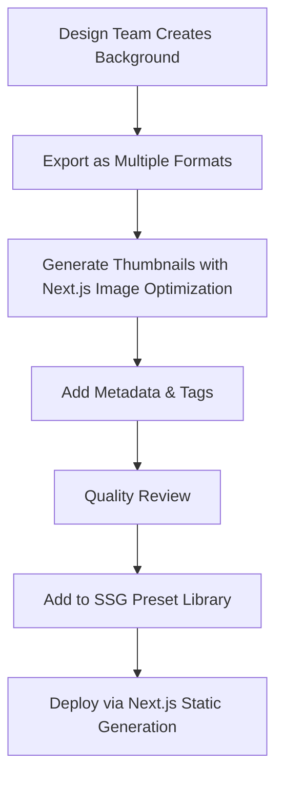

# Epic 3: Background & Canvas Styling

## Epic Goal

Provide sophisticated background options that elevate the visual appeal of mockups using Next.js 15 SSG optimization. Users will create stunning gradient backgrounds, apply preset styles, and enhance the overall canvas presentation to achieve professional results with sub-1s loading performance.

## Epic Description

### Purpose

This epic transforms Scroma from a basic frame application tool into a comprehensive mockup styling platform. It provides professional-grade background creation capabilities that enable users to match brand guidelines, create eye-catching presentations, and achieve design consistency across their mockups, all optimized for Next.js 15 SSG performance.

### Business Value

- Significantly increases perceived value of tool through advanced styling capabilities
- Enables brand consistency features that appeal to business users and teams
- Provides differentiation from basic screenshot tools through creative background options
- Supports premium feature positioning for advanced gradient and pattern tools
- Leverages Next.js 15 SSG for instant background preset loading and smooth interactions

### Technical Implementation

- Real-time gradient builder with visual controls and mathematical precision using Next.js client optimization
- Comprehensive preset library with categorization and search capabilities via SSG pre-loading
- Advanced canvas styling options including shadows, reflections, and effects
- Performance-optimized rendering for complex backgrounds without canvas lag using Next.js optimization patterns
- Background presets served via Next.js static generation for instant loading

## User Stories

### Story 3.1: Gradient Builder Interface

**Goal:** Enable custom gradient background creation with professional controls using Next.js client optimization
**Effort:** 13 story points
**Dependencies:** Epic 2 (Frame System for visual context)

**Acceptance Criteria:**

1. Gradient editor with visual preview updates in real-time using Next.js client-side rendering
2. Support for 2-5 color stops with add/remove functionality
3. Color picker for each stop with hex input option
4. Gradient angle adjustment via slider (0-360°) or direct input
5. Linear and radial gradient type toggle
6. Gradient preview shows on both thumbnail and main canvas with Next.js optimization
7. Copy gradient code feature for reuse in other tools
8. Gradient generation optimized for Next.js client performance patterns

### Story 3.2: Background Preset Library

**Goal:** Provide curated collection of professional background styles via Next.js SSG
**Effort:** 8 story points
**Dependencies:** Story 3.1

**Acceptance Criteria:**

1. Minimum 20 preset gradients covering popular styles, pre-loaded via Next.js SSG
2. Preset categories (Subtle, Vibrant, Dark, Light, Brand Colors) served statically
3. One-click application with instant canvas update using Next.js client optimization
4. Preset thumbnails show accurate preview of gradient using Next.js Image component
5. Favorite system allows marking frequently used presets with localStorage persistence
6. Recently used section shows last 5 applied backgrounds
7. Search functionality finds presets by name or color with client-side filtering
8. Background presets cached via Next.js static optimization for instant access

### Story 3.3: Solid Colors & Patterns

**Goal:** Offer alternative background options beyond gradients with Next.js performance optimization
**Effort:** 8 story points
**Dependencies:** Story 3.2

**Acceptance Criteria:**

1. Solid color picker with common color swatches
2. Hex, RGB, and HSL input methods supported
3. Basic patterns available (dots, lines, grid) with color customization
4. Pattern density/size adjustment controls
5. Transparency option for no background (checkerboard preview)
6. Background blur option for subtle depth effect using Next.js client-side processing
7. Quick access to white, black, and transparent backgrounds
8. Pattern generation optimized for Next.js performance patterns

### Story 3.4: Canvas Enhancement Options

**Goal:** Provide professional finishing touches for complete mockup presentation with Next.js state management
**Effort:** 8 story points
**Dependencies:** Story 3.3

**Acceptance Criteria:**

1. Canvas padding adjustment changes space around frame (0-200px)
2. Rounded corners option for entire composition (0-50px)
3. Shadow settings for lifted/floating appearance
4. Reflection effect toggle with intensity control
5. Vignette option with customizable intensity
6. Canvas size presets for common social media dimensions
7. Background position adjustment for gradient centering
8. Enhancement effects managed with Zustand and Next.js client optimization

## Technical Architecture

### Next.js 15 Component Structure

```
components/background-studio/
├── gradient-builder.tsx         # Main gradient creation interface with Next.js optimization
├── color-stop-editor.tsx       # Individual color stop controls
├── gradient-preview.tsx        # Real-time gradient preview using Next.js client rendering
├── preset-library.tsx          # Background preset collection with SSG data
├── preset-category-filter.tsx  # Category filtering system
├── solid-color-picker.tsx      # Solid color selection
├── pattern-selector.tsx        # Pattern background options
└── canvas-effects-panel.tsx    # Canvas enhancement controls

lib/background/
├── gradient-generator.ts       # Gradient CSS generation optimized for Next.js
├── pattern-generator.ts        # Pattern creation utilities
├── background-renderer.ts      # Canvas background rendering with Next.js performance
└── preset-manager.ts          # Preset loading and management via SSG
```

### State Management Extensions (Zustand + Next.js)

```typescript
interface BackgroundState {
  // Current background
  backgroundType: "gradient" | "solid" | "pattern" | "transparent";
  gradient: GradientConfig;
  solidColor: string;
  pattern: PatternConfig;

  // Canvas effects
  canvasEffects: CanvasEffects;

  // Preset management (Next.js SSG optimized)
  presets: BackgroundPreset[];
  categories: PresetCategory[];
  favorites: string[]; // Persisted via localStorage
  recentlyUsed: string[]; // Persisted via localStorage

  // UI state
  isGenerating: boolean;
  previewMode: boolean;
  nextjsPresetCache: Map<string, any>;
}

interface GradientConfig {
  type: "linear" | "radial";
  angle: number;
  stops: ColorStop[];
  centerX?: number; // for radial gradients
  centerY?: number; // for radial gradients
}

interface ColorStop {
  id: string;
  color: string;
  position: number; // 0-100%
  opacity: number; // 0-1
}

interface CanvasEffects {
  padding: number;
  borderRadius: number;
  shadow: ShadowConfig;
  reflection: ReflectionConfig;
  vignette: VignetteConfig;
}
```

### Next.js 15 Background Preset System

```typescript
interface BackgroundPreset {
  id: string;
  name: string;
  category: string;
  thumbnail: string;
  nextjsThumbnail: string; // Optimized for Next.js Image
  config: BackgroundConfig;
  tags: string[];
  popularity: number;
}

// Next.js SSG data loading
export async function getStaticProps() {
  const presets = await loadBackgroundPresets();
  const categories = await loadPresetCategories();

  return {
    props: {
      presets,
      categories,
    },
    revalidate: false, // Static presets don't change
  };
}

// Preset categories served via SSG
const PRESET_CATEGORIES = [
  { id: "subtle", name: "Subtle", description: "Soft, understated gradients" },
  { id: "vibrant", name: "Vibrant", description: "Bold, eye-catching colors" },
  { id: "dark", name: "Dark", description: "Dark themes and night modes" },
  { id: "light", name: "Light", description: "Clean, bright backgrounds" },
  {
    id: "brand",
    name: "Brand Colors",
    description: "Popular brand color schemes",
  },
  {
    id: "social",
    name: "Social Media",
    description: "Optimized for social platforms",
  },
] as const;
```

### Next.js 15 Performance Optimizations

```typescript
// Background preset component with Next.js Image optimization
import Image from "next/image";

export function BackgroundPreset({ preset }: { preset: BackgroundPreset }) {
  return (
    <div className="preset-item">
      <Image
        src={preset.nextjsThumbnail}
        alt={preset.name}
        width={120}
        height={80}
        priority={preset.category === "popular"} // Prioritize popular presets
        loading="lazy"
        placeholder="blur"
        blurDataURL="data:image/jpeg;base64,/9j/..."
      />
    </div>
  );
}

// Gradient generation with Next.js client optimization
export function useGradientGenerator() {
  const generateGradient = useCallback((config: GradientConfig) => {
    // Optimized gradient CSS generation
    return `linear-gradient(${config.angle}deg, ${config.stops
      .map((stop) => `${stop.color} ${stop.position}%`)
      .join(", ")})`;
  }, []);

  return { generateGradient };
}
```

## Definition of Done

### Functional Requirements

- [ ] All user stories completed with acceptance criteria met
- [ ] Gradient builder supports complex multi-stop gradients with Next.js optimization
- [ ] Preset library contains minimum 20 high-quality backgrounds served via SSG
- [ ] Canvas effects apply without performance degradation
- [ ] Background changes integrate seamlessly with existing frames
- [ ] Next.js SSG delivers instant background preset loading

### Performance Requirements

- [ ] Real-time gradient updates maintain 60fps canvas performance with Next.js optimization
- [ ] Background application completes within 200ms
- [ ] Preset loading and preview generation under 100ms via SSG
- [ ] Complex gradients with 5+ stops render smoothly
- [ ] SSG pre-loading eliminates background loading delays

### Quality Requirements

- [ ] Gradient mathematical precision matches design tool standards
- [ ] Color accuracy maintained across different display types
- [ ] Background effects render consistently across browsers
- [ ] High-resolution export preserves background quality
- [ ] Next.js Image component handles background thumbnails automatically

### User Experience Requirements

- [ ] Gradient creation intuitive for users without design experience
- [ ] Preset discovery and application under 15 seconds via SSG optimization
- [ ] Real-time feedback for all background adjustments using Next.js client patterns
- [ ] Background changes provide immediate visual impact
- [ ] SSG optimization ensures sub-1s background panel loading

## Success Metrics

### Feature Adoption

- **Target:** 70% of users who apply frames also customize backgrounds
- **Measurement:** Analytics tracking background panel usage and application

### Creative Usage

- **Target:** 40% of users create custom gradients vs. using presets only
- **Measurement:** Tracking gradient builder usage vs. preset application

### User Satisfaction

- **Target:** 85% of users rate background quality as "professional" or higher
- **Measurement:** User surveys and feedback collection

### Performance Impact (Next.js 15 Optimized)

- **Target:** Background features add <100ms to overall export time
- **Measurement:** Performance monitoring of background rendering
- **Next.js Target:** Background presets load instantly via SSG

## Risk Assessment

### Primary Risk: Performance Impact on Canvas Rendering

**Mitigation:**

- Efficient gradient generation using CSS gradients and Canvas API with Next.js optimization
- Background rendering optimization with caching strategies via Next.js static assets
- Progressive complexity reduction for lower-performance devices
- SSG pre-loading eliminates runtime performance impact

### Secondary Risk: Color Accuracy and Consistency

**Mitigation:**

- Color space standardization across different displays
- Consistent color picker implementation with accessibility support
- Color contrast validation for accessibility compliance
- Next.js client-side color management for consistency

### Tertiary Risk: Overwhelming Users with Too Many Options

**Mitigation:**

- Progressive disclosure of advanced features
- Smart defaults and recommended presets via SSG categorization
- Clear categorization and search functionality with client-side filtering

### Rollback Plan

- Feature flags for individual background components
- Fallback to solid color backgrounds if gradient system fails
- Preset library versioning for quick content rollback
- Next.js static regeneration for background asset updates

## Integration Points

### Upstream Dependencies

- Epic 1: Canvas system for background rendering with Next.js optimization
- Epic 2: Frame system for visual context and layering
- Epic 1: State management for background persistence using Zustand

### Downstream Dependencies

- Epic 4: Text overlays will need to consider background contrast
- Epic 5: Export system will include background data in output
- Epic 6: AI Integration will provide smart background suggestions via API routes

### Next.js 15 Integration Points

- **SSG Optimization:** Background presets pre-loaded for instant access
- **Image Optimization:** Automatic background thumbnail conversion and sizing
- **Bundle Optimization:** Background code split for optimal loading
- **Static Generation:** Preset library generates at build time for maximum performance
- **Client Optimization:** Real-time gradient generation optimized for Next.js patterns

### Design System Integration

- Color palette alignment with brand guidelines
- Gradient presets matching design system tokens
- Accessibility compliance for color contrast ratios
- Next.js-based design token integration

## Background Asset Pipeline

### Next.js 15 Preset Creation Workflow



### Quality Standards

- **Color Accuracy:** All gradients tested across major display types
- **Performance:** Each preset renders within 50ms on target hardware
- **Accessibility:** High contrast options available for all categories
- **Consistency:** Visual style aligned with Scroma brand guidelines
- **Next.js Optimization:** All assets optimized for SSG delivery

## Future Enhancements (Out of Scope)

### Advanced Features

- Video backgrounds and animated gradients
- AI-powered background generation via Next.js API routes
- Custom pattern creation tools
- Background removal and replacement using AI integration
- Collaborative background libraries

### Integration Features

- Brand color extraction from uploaded logos
- API routes for programmatic background generation
- Integration with design tools (Figma, Adobe)
- Background marketplace for community contributions via Next.js API

---

**Epic Owner:** Winston (Architect)
**Technical Lead:** Development Team
**Business Stakeholder:** Product Manager
**Timeline:** Sprint 5-6 (4 weeks)
**Priority:** P2 - Enhancement feature
**Next.js 15 Migration:** Complete architecture update for SSG optimization
