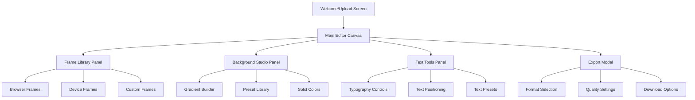
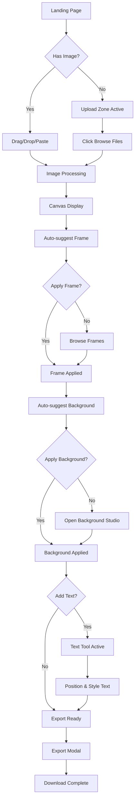
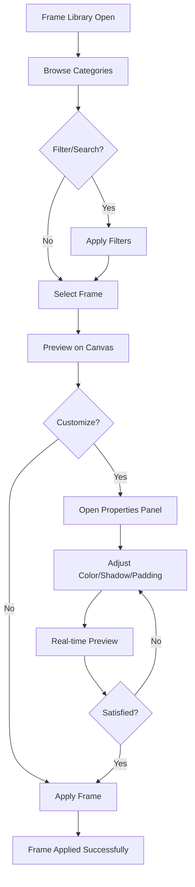
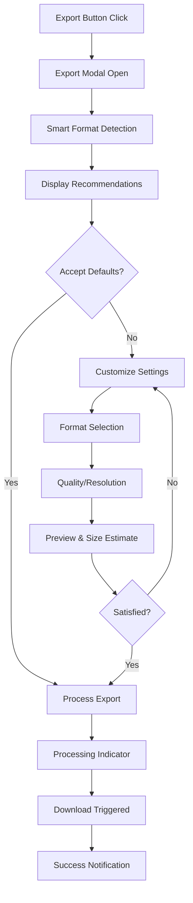

# Scroma UI/UX Specification

This document defines the user experience goals, information architecture, user flows, and visual design specifications for **Scroma's** user interface. It serves as the foundation for visual design and frontend development, ensuring a cohesive and user-centered experience that transforms plain screenshots into professional mockups in under 2 minutes.

## Overall UX Goals & Principles

### Target User Personas

- **Content Creator:** Social media managers and bloggers who need polished mockups for presentations and posts
- **Developer:** Software developers showcasing applications, APIs, or code snippets in documentation
- **Marketing Professional:** Digital marketers creating promotional materials and case studies

### Usability Goals

- **Speed:** New users complete their first mockup within 2 minutes of upload
- **Efficiency:** Experienced users create professional mockups in under 30 seconds
- **Quality:** Output matches professional design standards without design expertise
- **Accessibility:** All users can navigate and create using keyboard-only interaction

### Design Principles

1. **Canvas-First Design** - The editing canvas dominates the interface with minimal chrome
2. **Immediate Feedback** - Every action shows real-time results with smooth 60fps interactions
3. **Progressive Revelation** - Basic tools visible by default, advanced options appear contextually
4. **Vibrant Professionalism** - Bold, futuristic aesthetics that maintain professional credibility
5. **One-Click Excellence** - Smart defaults produce high-quality results without adjustment

### Change Log
| Date | Version | Description | Author |
|------|---------|-------------|--------|
| 2025-01-17 | 1.0 | Initial UI/UX specification creation | Sally (UX Expert) |
| 2025-09-17 | 1.1 | Aligned with Next.js 15 + SSG stack and current architecture | John (PM) |
| 2025-09-18 | 2.0 | Updated for Next.js 15 with SSG and AI integration architecture | Architect |

## Information Architecture (IA)

### Site Map / Screen Inventory

### Navigation Structure

**Primary Navigation:** Floating action buttons positioned strategically around the canvas edge. Tool access through contextual floating panels that appear on-demand. No traditional header navigation to maximize canvas real estate.

**Secondary Navigation:** Slide-out panels for detailed controls (frame properties, gradient builder, text formatting). Breadcrumb-style workflow indicator showing Upload → Frame → Background → Text → Export progression.

**Breadcrumb Strategy:** Minimal workflow stepper that doubles as navigation. Users can jump between completed stages while maintaining context of current progress.

## User Flows

### Upload to First Mockup Flow

**User Goal:** Create a professional mockup from uploaded screenshot in under 2 minutes

**Entry Points:** Direct URL, bookmark, or referral from social media

**Success Criteria:** Downloaded high-quality mockup ready for presentation

**Edge Cases & Error Handling:**
- File too large: Automatic compression with quality preview
- Unsupported format: Convert to supported format with notification
- Browser compatibility: Graceful degradation with feature detection
- Slow connection: Progressive loading with skeleton states
- Canvas performance: Dynamic quality adjustment based on device capability

### Frame Selection & Customization Flow

**User Goal:** Find and apply the perfect frame with custom styling

**Entry Points:** From canvas with image loaded, or frame library direct access

**Success Criteria:** Frame applied with desired customizations

### Export & Download Flow

**User Goal:** Export mockup in optimal format and quality for intended use

**Entry Points:** Export button from main canvas, keyboard shortcut Ctrl+E

**Success Criteria:** High-quality file downloaded to device

## Wireframes & Mockups

**Primary Design Files:** Figma workspace linked to development handoff

### Key Screen Layouts

#### Main Editor Canvas
**Purpose:** Central workspace for all mockup creation activities

**Key Elements:**
- Full-viewport canvas with zoom/pan controls
- Floating tool palette (frame, background, text, export)
- Contextual property panels that slide in from edges
- Minimal UI chrome to maximize canvas space
- Real-time collaboration cursors for future team features

**Interaction Notes:** Canvas responds to drag-and-drop, zoom gestures, and keyboard shortcuts. All tools provide immediate visual feedback without mode switching.

**Design File Reference:** figma.com/scroma-editor-canvas

#### Frame Library Panel
**Purpose:** Visual selection and customization of frame options

**Key Elements:**
- Grid layout showcasing frame thumbnails with hover previews
- Category filters (Browser, Mobile, Desktop, Custom)
- Search functionality with auto-complete
- Frame properties panel for color, shadow, padding adjustments
- Recent/favorites quick access section

**Interaction Notes:** One-click application with undo support. Hover previews show frame on current canvas. Drag-and-drop alternative for power users.

**Design File Reference:** figma.com/scroma-frame-library

#### Background Studio
**Purpose:** Comprehensive background creation and customization

**Key Elements:**
- Gradient builder with visual controls and presets
- Color picker with accessibility compliance indicators
- Pattern options (dots, lines, noise) with density controls
- Preset library organized by mood/category
- Live preview thumbnail with canvas integration

**Interaction Notes:** Real-time updates to canvas as gradients are adjusted. Smart defaults based on frame selection. Preset application with customization options.

**Design File Reference:** figma.com/scroma-background-studio

## Component Library / Design System

### Design System Approach
**ShadCN/UI Foundation:** Leverage shadcn/ui components as the base system, extended with custom Scroma-specific components for canvas interaction and creative tools.

### Core Components

#### Canvas Toolbar
**Purpose:** Primary tool access with contextual state management

**Variants:** Floating (default), Docked (power user preference), Minimal (presentation mode)

**States:** Default, Active Tool, Disabled, Loading

**Usage Guidelines:** Always visible but unobtrusive. Adapts to canvas content with smart positioning. Keyboard accessible with logical tab order.

#### Property Panel (Extended shadcn Card)
**Purpose:** Contextual controls for selected elements

**Variants:** Slide-in (mobile), Overlay (desktop), Inline (compact)

**States:** Collapsed, Expanded, Loading, Error

**Usage Guidelines:** Appears only when relevant. Self-contained with clear close/dismiss options. Maintains state during panel switching.

#### Frame Thumbnail (Custom Component)
**Purpose:** Visual representation of frame options with interaction states

**Variants:** Grid (default), List (search), Large (preview)

**States:** Default, Hover, Selected, Loading, Unavailable

**Usage Guidelines:** Consistent aspect ratio for grid alignment. Hover preview without layout shift. Clear selection indicators.

#### Gradient Builder (Custom Component)
**Purpose:** Visual gradient creation with precise control

**Variants:** Simple (2 colors), Advanced (5+ colors), Radial, Linear

**States:** Building, Preview, Applied, Error

**Usage Guidelines:** Immediate visual feedback. Accessibility considerations for color selection. Export/import capability for sharing.

#### Export Quality Selector (Extended shadcn Slider)
**Purpose:** Balance between file size and quality

**Variants:** Simple (3 presets), Advanced (custom values), Batch (multiple settings)

**States:** Default, Calculating, Preview Available, Processing

**Usage Guidelines:** Clear file size estimates. Visual quality comparison. Smart defaults based on intended use.

## Branding & Style Guide

### Visual Identity
**Brand Guidelines:** Scroma brand identity document - Modern, vibrant, professional tooling aesthetic

### Color Palette

| Color Type | Hex Code | Usage |
|------------|----------|--------|
| Primary | #6366F1 | Primary CTAs, active states, brand elements |
| Secondary | #8B5CF6 | Secondary actions, hover states, accents |
| Accent | #06B6D4 | Success states, highlights, creative elements |
| Success | #10B981 | Confirmations, completed states, positive feedback |
| Warning | #F59E0B | Cautions, important notices, file size warnings |
| Error | #EF4444 | Errors, destructive actions, validation failures |
| Neutral | #6B7280, #F9FAFB, #111827 | Text, borders, backgrounds, UI structure |

### Typography

#### Font Families
- **Primary:** Inter (UI elements, body text, controls)
- **Secondary:** JetBrains Mono (code snippets, technical data)
- **Display:** Inter Display (large headings, marketing content)

#### Type Scale
| Element | Size | Weight | Line Height |
|---------|------|--------|-------------|
| H1 | 2.25rem (36px) | 800 | 1.2 |
| H2 | 1.875rem (30px) | 700 | 1.3 |
| H3 | 1.5rem (24px) | 600 | 1.4 |
| Body | 0.875rem (14px) | 400 | 1.5 |
| Small | 0.75rem (12px) | 400 | 1.4 |

### Iconography
**Icon Library:** Lucide icons for consistency with shadcn/ui ecosystem

**Usage Guidelines:** 16px and 20px sizes for UI, 24px for primary actions. Consistent stroke width of 2px. Color inheritance from parent elements.

### Spacing & Layout
**Grid System:** CSS Grid with 8px base unit system for consistent spacing

**Spacing Scale:** 4px, 8px, 16px, 24px, 32px, 48px, 64px progression for margins, padding, and component spacing

## Accessibility Requirements

### Compliance Target
**Standard:** WCAG AA compliance with selective AAA features for color contrast and keyboard navigation

### Key Requirements

**Visual:**
- Color contrast ratios: 4.5:1 for normal text, 3:1 for large text, 7:1 for essential UI elements
- Focus indicators: 2px solid outline with high contrast, persistent during interaction
- Text sizing: Responsive scaling up to 200% without horizontal scrolling

**Interaction:**
- Keyboard navigation: Full functionality accessible via keyboard with logical tab order
- Screen reader support: Semantic markup, ARIA labels, live regions for dynamic content updates
- Touch targets: Minimum 44px clickable area for all interactive elements

**Content:**
- Alternative text: Descriptive alt text for all meaningful images and icons
- Heading structure: Logical H1-H6 hierarchy for document outline
- Form labels: Explicit labels for all form controls with error messaging

### Testing Strategy
Automated testing with axe-core, manual testing with NVDA/JAWS screen readers, keyboard-only navigation testing, and color contrast validation during design phase.

## Responsiveness Strategy

### Breakpoints
| Breakpoint | Min Width | Max Width | Target Devices |
|------------|-----------|-----------|----------------|
| Mobile | 320px | 767px | iPhone, Android phones (read-only preview) |
| Tablet | 768px | 1023px | iPad, Android tablets (limited editing) |
| Desktop | 1024px | 1439px | Laptops, small desktop monitors |
| Wide | 1440px | - | Large monitors, ultrawide displays |

### Adaptation Patterns

**Layout Changes:** Canvas remains central at all breakpoints. Tool panels transform from floating to slide-in drawers on tablet. Mobile shows preview-only with export functionality.

**Navigation Changes:** Floating buttons become bottom-sheet on mobile. Tool switching via swipe gestures on tablet. Desktop maintains hover interactions.

**Content Priority:** Essential tools (frame, background, export) always visible. Advanced features progressive disclosure. Mobile prioritizes viewing and sharing over editing.

**Interaction Changes:** Touch-optimized controls on mobile/tablet. Hover states disabled appropriately. Gesture support for zoom/pan on touch devices.

## Animation & Micro-interactions

### Motion Principles
Smooth, purposeful animations that enhance usability without distraction. 60fps performance target with reduced-motion respect. Easing curves emphasize professional tool aesthetic.

### Key Animations
- **Panel Transitions:** 300ms ease-out slide animations for tool panels
- **Canvas Zoom:** Smooth interpolation with momentum scrolling (200ms, ease-in-out)
- **Frame Application:** 150ms fade-in with subtle scale animation
- **Tool State Changes:** 100ms color transitions for immediate feedback
- **Export Progress:** Animated progress bar with completion celebration
- **Drag & Drop:** Real-time visual feedback with shadow and scaling
- **Hover Previews:** 200ms fade-in with slight scale increase

## Performance Considerations

### Performance Goals
- **Page Load:** Initial render under 2 seconds on 10Mbps connection
- **Interaction Response:** Canvas operations under 16ms for 60fps
- **Animation FPS:** Consistent 60fps for all transitions and interactions

### Design Strategies
Progressive image loading with blur-up technique. Canvas virtualization for large images. Component lazy loading for tool panels. Optimized asset delivery through CDN. Client-side caching for frames and presets.

## Next Steps

### Immediate Actions
1. Stakeholder review and approval of UX specification
2. High-fidelity mockup creation in Figma with component library
3. Usability testing plan development for key user flows
4. Technical architecture handoff meeting with development team
5. Component library mapping to shadcn/ui implementation strategy

### Design Handoff Checklist
- [x] All user flows documented with edge cases
- [x] Component inventory complete with state definitions
- [x] Accessibility requirements defined with testing strategy
- [x] Responsive strategy clear with breakpoint specifications
- [x] Brand guidelines incorporated with vibrant futuristic aesthetic
- [x] Performance goals established with optimization strategies
